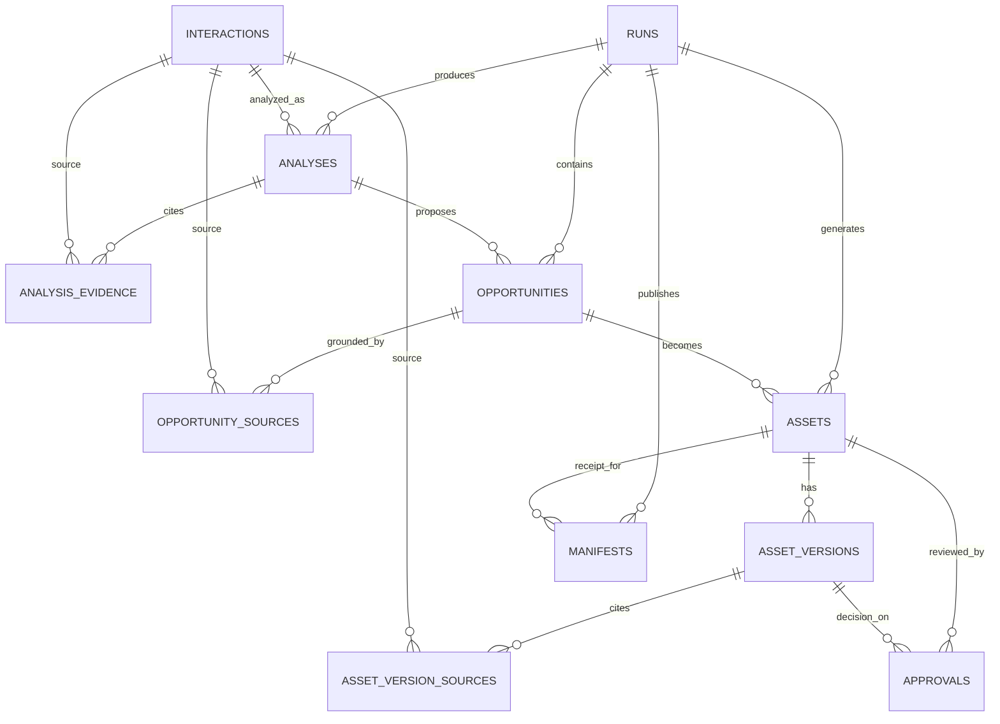

# CL-002 — Modelo de datos persistente del MVP

Estado: propuesta para revisión antes de crear migraciones.

Relacionado:

- GitHub [#36](https://github.com/No-Country-simulation/G10-ONE-equipo-14/issues/36)
- GitHub Epic E2 [#64](https://github.com/No-Country-simulation/G10-ONE-equipo-14/issues/64)
- Jira [COMLAB-67](https://g10-latam-equipo14.atlassian.net/browse/COMLAB-67)
- Jira Epic [COMLAB-11](https://g10-latam-equipo14.atlassian.net/browse/COMLAB-11)

## Objetivo

Extender las tablas existentes `interactions` y `runs` para persistir análisis, oportunidades, activos versionados, decisiones de curaduría y recibos de publicación. El modelo debe conservar evidencia verificable desde cada activo hasta las interacciones originales.

## Decisiones

1. Todas las claves primarias son UUID.
2. `runs` mantiene el contexto de organización y comunidad; las entidades derivadas pertenecen a un `run`.
3. La evidencia utiliza claves foráneas hacia `interactions`, no listas de UUID sin integridad referencial.
4. Topics, entidades y contenido generado se guardan en JSONB porque su estructura pertenece al contrato versionado y no requiere consultas relacionales en el MVP.
5. Las ediciones de contenido crean una fila nueva en `asset_versions`; nunca sobrescriben una versión anterior.
6. Las decisiones crean filas inmutables en `approvals`.
7. `assets.current_version_id` identifica la versión visible y evita calcularla por `max(version_number)` en cada consulta.
8. Un manifest representa un objeto efectivamente publicado. No se crea antes de recibir la confirmación del almacenamiento.
9. Las migraciones existentes `001` y `002` no se modifican.
10. Los estados se almacenan como texto con `CHECK`, evitando enums PostgreSQL difíciles de evolucionar durante el MVP.

## Diagrama

## Tablas existentes

### `interactions`

Se conserva sin cambios. Es la fuente original normalizada y deduplicada.

### `runs`

Se conserva su contrato actual. Una migración posterior podrá añadir el trigger de `updated_at`, pero no debe alterar el significado de idempotencia.

## Tablas nuevas

### `analyses`

Una interacción puede tener un análisis por ejecución. La misma interacción puede analizarse nuevamente en otro run o con otra versión del modelo.

| Campo | Tipo | Regla |
| --- | --- | --- |
| `id` | UUID | PK |
| `run_id` | UUID | FK `runs.id`, `ON DELETE CASCADE` |
| `interaction_id` | UUID | FK `interactions.id`, `ON DELETE RESTRICT` |
| `schema_version` | varchar(20) | No vacío |
| `sentiment` | varchar(40) | No vacío |
| `topics` | JSONB | Array JSON, default `[]` |
| `entities` | JSONB | Array JSON, default `[]` |
| `relevance` | numeric(5,4) | Entre 0 y 1 |
| `confidence` | numeric(5,4) | Entre 0 y 1 |
| `model` | varchar(120) | No vacío |
| `prompt_version` | varchar(80) | No vacío |
| `created_at` | timestamptz | Default `now()` |

Constraints e índices:

- `UNIQUE(run_id, interaction_id)`.
- Índice `(run_id, created_at)`.
- Índice `interaction_id` para trazabilidad.

### `analysis_evidence`

Evidencia textual que respalda un análisis.

| Campo | Tipo | Regla |
| --- | --- | --- |
| `id` | UUID | PK |
| `analysis_id` | UUID | FK `analyses.id`, `ON DELETE CASCADE` |
| `interaction_id` | UUID | FK `interactions.id`, `ON DELETE RESTRICT` |
| `excerpt` | text | No vacío |
| `created_at` | timestamptz | Default `now()` |

Constraint: `UNIQUE(analysis_id, interaction_id, excerpt)`.

### `opportunities`

Una decisión de contenido derivada de un análisis.

| Campo | Tipo | Regla |
| --- | --- | --- |
| `id` | UUID | PK |
| `run_id` | UUID | FK `runs.id`, `ON DELETE CASCADE` |
| `analysis_id` | UUID | FK `analyses.id`, `ON DELETE CASCADE` |
| `schema_version` | varchar(20) | No vacío |
| `kind` | varchar(60) | No vacío |
| `priority` | numeric(5,4) | Entre 0 y 1 |
| `reason` | text | No vacío |
| `status` | varchar(40) | `PENDING`, `REVIEW_REQUIRED` o `BLOCKED` |
| `created_at` | timestamptz | Default `now()` |
| `updated_at` | timestamptz | Default `now()` |

Índices:

- `(run_id, status, created_at)`.
- `analysis_id`.

No se fuerza una sola oportunidad por análisis; el modelo admite varios canales u oportunidades futuras.

### `opportunity_sources`

Tabla puente entre oportunidades e interacciones fuente.

| Campo | Tipo | Regla |
| --- | --- | --- |
| `opportunity_id` | UUID | FK `opportunities.id`, `ON DELETE CASCADE` |
| `interaction_id` | UUID | FK `interactions.id`, `ON DELETE RESTRICT` |

PK compuesta: `(opportunity_id, interaction_id)`.

### `assets`

Identidad estable del contenido generado, separada de sus versiones.

| Campo | Tipo | Regla |
| --- | --- | --- |
| `id` | UUID | PK |
| `run_id` | UUID | FK `runs.id`, `ON DELETE CASCADE` |
| `opportunity_id` | UUID | FK `opportunities.id`, `ON DELETE RESTRICT` |
| `schema_version` | varchar(20) | No vacío |
| `asset_type` | varchar(40) | `LINKEDIN` o `FAQ` |
| `status` | varchar(40) | `PENDING_REVIEW`, `APPROVED` o `REJECTED` |
| `current_version_id` | UUID nullable | FK diferida a `asset_versions.id` |
| `created_at` | timestamptz | Default `now()` |
| `updated_at` | timestamptz | Default `now()` |

Constraints e índices:

- `UNIQUE(opportunity_id, asset_type)` para el MVP.
- Índice `(status, created_at)` para la cola de curaduría.
- La FK de `current_version_id` se agrega después de crear `asset_versions`.

### `asset_versions`

Contenido inmutable de cada versión del activo.

| Campo | Tipo | Regla |
| --- | --- | --- |
| `id` | UUID | PK |
| `asset_id` | UUID | FK `assets.id`, `ON DELETE CASCADE` |
| `version_number` | integer | Mayor que 0 |
| `title` | text | No vacío |
| `content` | JSONB | Contrato completo de claims/contenido |
| `model` | varchar(120) nullable | Modelo generador |
| `prompt_version` | varchar(80) nullable | Prompt generador |
| `created_by` | varchar(200) | `SYSTEM` o identificador del revisor |
| `created_at` | timestamptz | Default `now()` |

Constraint: `UNIQUE(asset_id, version_number)`.

### `asset_version_sources`

Garantiza que cada versión conserve referencias válidas a sus interacciones fuente.

| Campo | Tipo | Regla |
| --- | --- | --- |
| `asset_version_id` | UUID | FK `asset_versions.id`, `ON DELETE CASCADE` |
| `interaction_id` | UUID | FK `interactions.id`, `ON DELETE RESTRICT` |
| `excerpt` | text | No vacío |

PK compuesta: `(asset_version_id, interaction_id, excerpt)`.

### `approvals`

Registro inmutable de decisiones humanas.

| Campo | Tipo | Regla |
| --- | --- | --- |
| `id` | UUID | PK |
| `asset_id` | UUID | FK `assets.id`, `ON DELETE RESTRICT` |
| `asset_version_id` | UUID | FK `asset_versions.id`, `ON DELETE RESTRICT` |
| `reviewer` | varchar(200) | No vacío |
| `decision` | varchar(20) | `APPROVED` o `REJECTED` |
| `comment` | text nullable | Comentario del revisor |
| `created_at` | timestamptz | Default `now()` |

Índice: `(asset_id, created_at DESC)`.

### `manifests`

Recibo de un objeto publicado en OCI u otro adapter compatible.

| Campo | Tipo | Regla |
| --- | --- | --- |
| `id` | UUID | PK |
| `run_id` | UUID | FK `runs.id`, `ON DELETE RESTRICT` |
| `asset_id` | UUID nullable | FK `assets.id`, `ON DELETE RESTRICT` |
| `schema_version` | varchar(20) | No vacío |
| `bucket` | varchar(255) | No vacío |
| `object_key` | text | No vacío |
| `content_type` | varchar(150) | No vacío |
| `sha256` | char(64) | Hexadecimal SHA-256 |
| `etag` | varchar(255) nullable | Recibo del proveedor |
| `created_at` | timestamptz | Default `now()` |

Constraints e índices:

- `UNIQUE(bucket, object_key)`.
- Índice `run_id`.
- `CHECK` para el formato hexadecimal de `sha256`.

## Responsabilidades por capa

### PostgreSQL

PostgreSQL garantiza:

- PK, FK y comportamiento `ON DELETE`.
- Unicidad e índices.
- Campos obligatorios y textos no vacíos.
- Rangos numéricos de 0 a 1.
- Estados pertenecientes a conjuntos conocidos.
- Formato SHA-256.
- `updated_at` consistente incluso ante SQL directo.

### Dominio Python

Python garantiza:

- Que análisis, oportunidad y activo pertenecen a la misma organización/comunidad y run.
- Que una oportunidad contiene al menos una fuente.
- Que cada claim tiene evidencia suficiente.
- Que `current_version_id` pertenece al mismo asset.
- Que sólo la versión actual puede aprobarse.
- Que un asset aprobado no se edita; una modificación genera nueva versión y vuelve a revisión.
- Que sólo assets aprobados pueden publicarse.
- Que el checksum corresponde exactamente al contenido enviado.
- Transiciones de estado y autorización del revisor.

Estas reglas requieren leer varias filas o ejecutar servicios externos, por lo que no deben implementarse como triggers opacos.

## Triggers propuestos

La decisión final corresponde a CL-005 / COMLAB-68.

### Aprobado para implementación

`set_updated_at()`:

- Evento: `BEFORE UPDATE`.
- Tablas: `runs`, `opportunities` y `assets`.
- Acción: asignar `NEW.updated_at = now()`.
- Justificación: mantiene el timestamp correcto para actualizaciones hechas por ORM, scripts o SQL directo.
- Error: no consume servicios ni genera efectos externos; participa en la misma transacción.

### No implementar como trigger

- Crear approvals automáticamente cuando cambia `assets.status`: perdería reviewer, comentario e intención explícita.
- Publicar en OCI al aprobar: un trigger de base no debe llamar servicios externos.
- Incrementar versiones automáticamente: el servicio debe construir y validar el contenido antes de insertar.
- Copiar evidencia a tablas derivadas: la transacción del servicio debe escribirla explícitamente.
- Generar historial genérico de todas las columnas: las tablas `asset_versions` y `approvals` ya expresan la auditoría requerida.

## Estrategia de migraciones

1. `003_create_content_entities.py`
   - Crea analyses, evidence, opportunities y sources.
   - Crea assets, versions, version sources y approvals.
   - Crea manifests.
   - Agrega `assets.current_version_id` al final para resolver la dependencia circular controlada.
2. `004_add_updated_at_triggers.py`
   - Crea la función `set_updated_at()`.
   - Instala triggers en runs, opportunities y assets.
   - Incluye downgrade que elimina triggers y función.

Cada downgrade elimina objetos en orden inverso y se prueba únicamente en una base aislada.

## Orden de implementación

1. Revisar y aprobar este documento.
2. Crear modelos SQLAlchemy y registrarlos en `Base.metadata`.
3. Crear migración 003 y pruebas de constraints/FK.
4. Adaptar servicios para persistir las entidades.
5. Crear migración 004 y pruebas de `updated_at`.
6. Implementar consulta de run con sus resultados.
7. Integrar el dashboard y producir evidencias de E2.

## Preguntas resueltas

- ¿JSONB o tablas para evidencia? Tablas, porque la evidencia necesita FK a interacciones.
- ¿JSONB o tablas para claims? El cuerpo versionado queda en JSONB; sus fuentes se normalizan en `asset_version_sources`.
- ¿Enums PostgreSQL? No durante el MVP; `varchar + CHECK` simplifica migraciones evolutivas.
- ¿Borrado en cascada de interacciones? No. Una interacción referenciada no se elimina físicamente durante el MVP.
- ¿Un asset se sobrescribe? No; se agrega una versión y se actualiza el puntero actual.
- ¿OCI se llama desde un trigger? No; se utiliza un adapter desde Python.

## Criterios de aceptación CL-002

- [x] Diagrama propuesto.
- [x] Campos, relaciones, constraints e índices documentados.
- [x] Estrategia de migraciones definida.
- [x] Separación entre constraints, triggers y dominio registrada.
- [ ] Revisión del equipo completada.
- [ ] Aprobación antes de crear migraciones.
